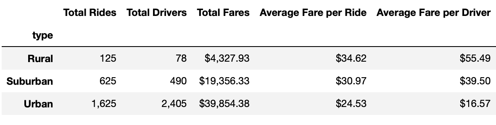

# PyBer-Analysis

## Overview of the Project

In this project, an exploratory analysis is required to be performed on data in some large csv files for PyBer which is a python based ride-sharing app company helping them enhance access to ride-sharing services and identify affordability for underserved neighborhoods.

### Purpose

The purpose of this project is to write certain python scripts with the use of Pandas library and Jupyter notebook to create a summary DataFrame of the ride-sharing data by city types which are in terms of rural, suburban, and urban. Additionally, to aid the process of visualization, it is required to use Matplotlib library for creating a multiple-line graph that demonstrates the total weekly fares for each of the city types.

## Results

This section of the report focuses on the results achieved from the analysis performed describing the differences in ride-sharing data among different city types.

### Summary DataFrame

Figure below depicts the summary DataFrame of the ride-sharing data which includes the total rides, total drivers, average fare per ride and average fare per driver that has been created with the use of **groupby()**, **count()**, and **sum()** functions. 

As it can be seen in the PyBer summary DataFrame, the total number of drivers and rides is higher in urban cities. Whereas, rural cities have the least number of drivers and rides among suburban and urban city types. Thus, by looking at the number of rides and drivers in each of the city types, urban cities generate highest amount of revenue while rural cities make the least amount of profit as indicated in the total fares column. 

On the other hand, if we further analyze the data it is shown that the average fare per ride and the average fare per driver is the least in urban cities although they have higher total fares, while rural cities have higher average fare per ride and driver, where drivers make about 3 times and 1.4 times more than drivers in urban and suburban cities respectively. The following result could be due to longer distance being covered between destinations per ride in rural cities while in urban and suburban cities distance covered between destinations might generally be shorter.

### Total Weekly Fares

Figure below depicts the multiple-line graph displaying the total weekly fare by city types from January to April 2019. As it was expected, urban cities have the highest total fare throughout entire weeks of January to April, while rural cities have the least total fares, with suburban cities falling somewhere in between the two. Additionally, all the city types seem to generally bring the highest revenue in the third week of February and the least total fare at the beginning of January.

## Summary

Based on the performed analysis on the ride-sharing data and results achieved, some business recommendations can be provided to the CEO of PyBer for addressing any disparities among the city types. These recommendations are as follow:

- It would be highly recommended for PyBer to continue as well as increase their investment in the urban cities and encouraging the drivers to continue in the same manner by slightly increasing the fare rates since this city type is performing very well by having the highest total fares and higher number of rides among other city types. Hence, this would help PyBer to increase their chances of making even more profit.

- Secondly, placing a limit on the fare per ride in rural cities and implementing some program to increase the number of drivers. As this would result in a much more affordable service for the passengers which would cause the total number of rides to increase. Additionally, having enough drivers results in the ride demand to be met, hence increasing the total fares.

- Thirdly, it is recommended for PyBer to focus their efforts in marketing and advertising by implementing special deals biweekly since the total fare is mainly steady throughout majority of the weeks between January to April in all the city types. By this way PyBer will be able to increase number of rides thus, generating more profit monthly and hence yearly.

