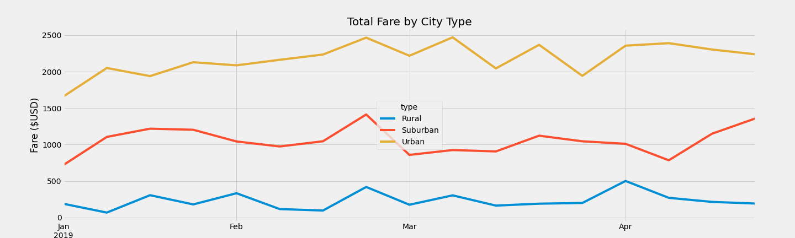

# PyBer-Analysis

## Overview of the Project

In this project, an exploratory analysis is required to be performed on data in some large csv files for PyBer which is a python based ride-sharing app company. Hence, helping PyBer enhance access to ride-sharing services and identify affordability for underserved neighborhoods.

### Purpose

The purpose of this project is to write some python scripts with the use of Panda's libraries, the Jupyter notebook to create a summary DataFrame of the ride-sharing data by city type which are in terms of Rural, Suburban, and Urban. Additionally, to aid the process of visualization, it is required to use Pandas and Matplotlib for creating a multiple-line graph that demonstrates the total weekly fares for each of the city types.

## Results

This section of the report focuses on the results achieved from the analysis performed describing the differences in ride-sharing data among the different city types.

### Summary DataFrame

 Figure below depicts the summary dataframe of ride-sharing data which includes the total rides, total drivers, total fares, average fare per ride and driver, as well as the total fare by city type has been created with the use of **groupby()**, **count()**, and **sum()** functions. 

As it can be seen in the PyBer summary dataframe, the total number of drivers and rides is higher in urban cities. Whereas, rural cities have the least number of drivers and riders among suburban and urban city types. Thus, looking at the number of rides and drivers in each of the city types, urban cities generate highest amount of revenue while rural cities make the least amount of profit as shown in the total fares column. 
However, if we further analyze the data it is shown that the average fare per ride and driver is the least in the urban cities although they have higher total fares, while rural cities have higher average fare per ride and driver, where drivers make about 3 times and 1.4 times more than drivers in urban and suburban cities. The following result could be due to longer distance covered between destinations per ride in rural cities which is the reason why fares per ride and driver are much higher in this city type, while in urban and suburban cities distances between destinations might usually be shorter.

### Total Weekly Fares

Figure below depicts the multiple-line graph displaying the total weekly fares for each city type from January to April 2019. As it was expected, urban cities have the highest total fare throughout entire weeks of January to April, while rural cities have the least total fares throughout all the weeks with suburban cities falling somewhere in between the two. Additionally, all the city types seem to bring the highest revenue in the third week of February and the least total fare at the beginning of January.

## Summary

Based on the performed analysis on the ride-sharing data and results achieved some business  recommendations can be provided to the CEO of PyBer for addressing any disparities among the city types. These recommendations are as follow:

- It would be highly recommended for PyBer to continue as well as increase their investment in the urban cities since this city type is performing very well by having the highest total fares and higher number of rides among other city types. This would help PyBer to increase their chances of making even more profit.

- Secondly, placing a limit on the fare per ride in rural cities and implementing some program to increase the number of drivers. As this would result in a much more affordable service for the passengers which would cause the total number of rides to increase additionally having enough drivers results in the ride demand to be met, hence resulting in higher total fares.

- Thirdly, it is recommended for PyBer to focus their efforts in marketing as well as investment in urban and rural cities, since suburban cities have been the middle performing cities throughout the entire analysis and no additional investment or effort is needed to be spend on suburban cities in this case whereas it could be saved for rural and urban city types.
